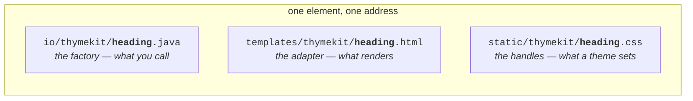
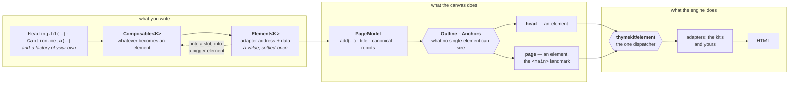
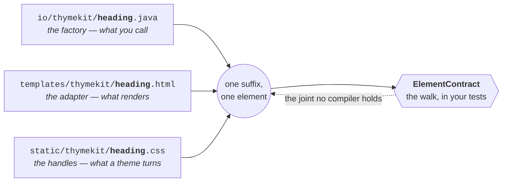
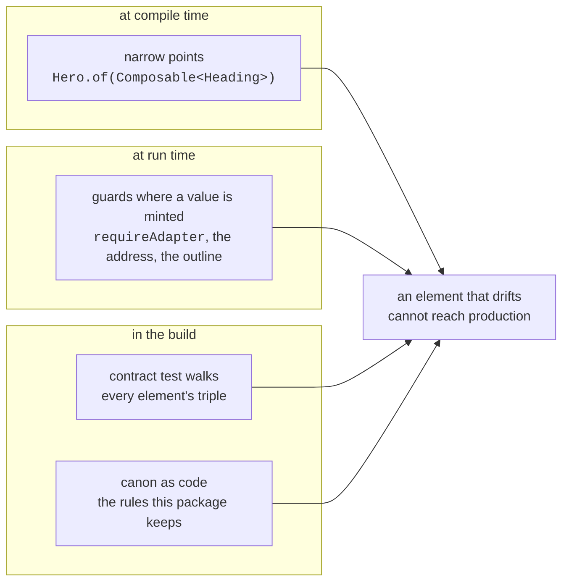
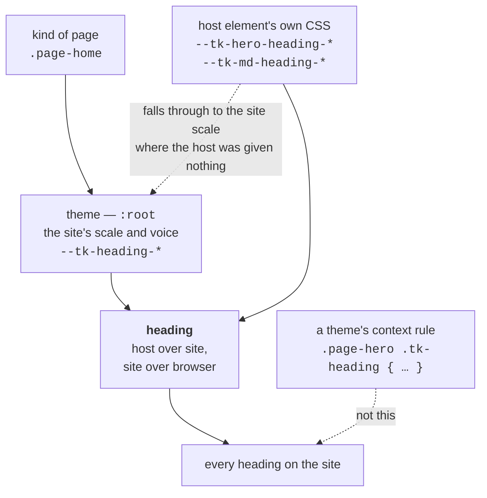
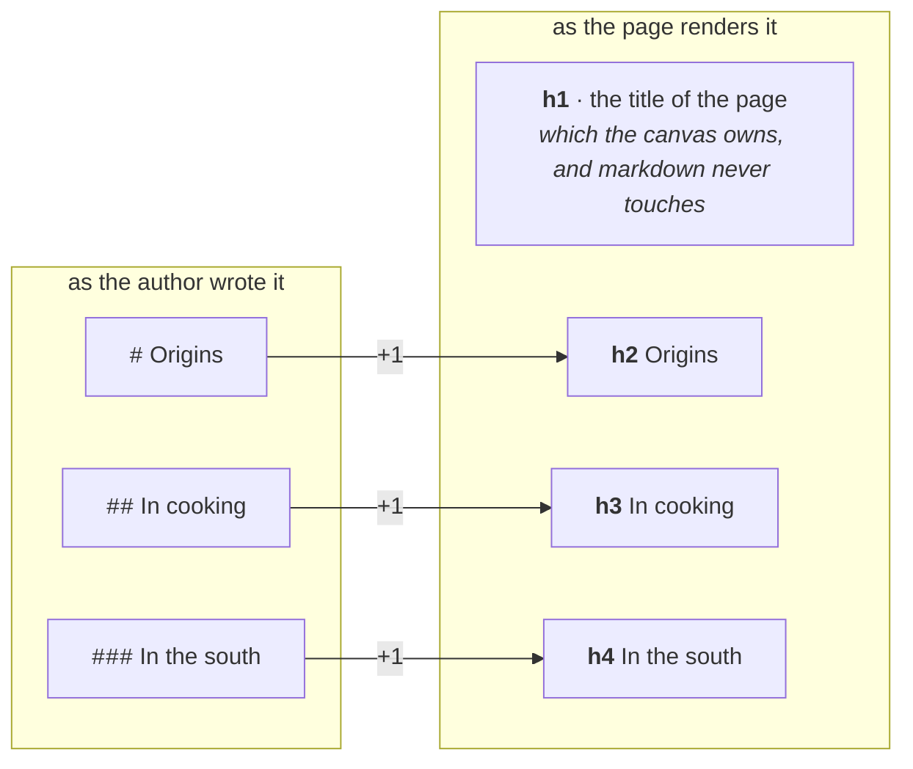
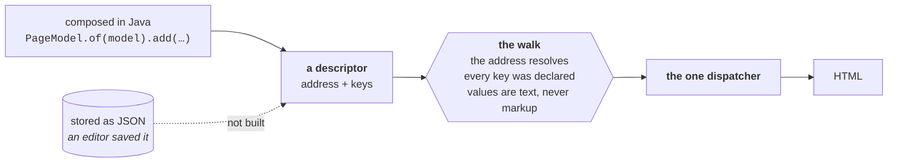

# thymekit

[](https://github.com/thymekit/thymekit/actions/workflows/build.yml)
[](https://thymekit.github.io/thymekit/main/tests/)
[](https://thymekit.github.io/thymekit/main/coverage/)
[](https://thymekit.github.io/thymekit/main/mutation/)
[](LICENSE)
[](#getting-started)
[](#getting-started)

## What this is

**Everything is an element, and an element is made of elements.**

*A composable element library for Spring Boot and Thymeleaf — pages declared in Java, rendered on
the server, plain stateless HTML out.*

### The problem it addresses

Go looking for a component in a server-rendered Java application and you will not find one. What you
find is a component-shaped thing spread across three files that have never been introduced:

| the part | where it lives | what ties it to the others |
|---|---|---|
| the data it needs | a method in a controller | a string key in a model |
| the markup | a fragment in a template file | a string address |
| the look | a few rules in a global stylesheet | a class name, also a string |

Nothing holds those three together, and the compiler has no opinion about any of them. Rename a CSS
class and the fragment keeps the old one; the page still renders, only wrong. Add a key to the model
and mistype it in the template, and the page renders too — with a hole where the value should be. No
build fails, no test turns red, and the defect is found by a person looking at a page. Multiply that
by every page in the application and consistency stops being a property of the code: it becomes a
matter of vigilance, spread across everyone who touches it.

### The idea

thymekit makes the element a first-class object, the way Java makes everything an object. The three
files stay where they are — but they are now one thing with one name, and something checks that they
still agree:



And every factory returns something that *becomes* an element — a `Composable<K>`, which a built
element is too, by returning itself. That one type is what lets elements go into elements without
limit — a caption into a heading group, a heading into a section, a section onto a page — and it is
why the kit needs no notion of a container, a slot type or a page kind.

### What it looks like

Here is a whole page. Not a sketch of one: a controller method that renders in production.

```java
@GetMapping("/ingredients/{slug}")
String ingredient(@PathVariable String slug, Model model) {
    Ingredient it = api.bySlug(slug);
    return PageModel.of(model)
        .title(it.name())
        .add(Hero.of(Heading.h1(it.name()))
            .eyebrow(Caption.eyebrow("Catalogue"))
            .subtitle(Caption.subtitle(it.latinName())))
        .add(Section.of(Heading.h2("Description"))
            .add(Md.of(it.description()).emptyHint("No description yet")))
        .render("ingredient-page");
}
```

Read it once more for what it does **not** say. No model keys. No fragment addresses. No CSS classes.
No `<main>`, no `<h1>`, no check that there is exactly one of them, no escaping of the description
somebody typed into a database. Those are not omissions to be filled in later — they are decisions
the kit has already made, and the rest of this document is mostly about which ones and why.

Pages become declarations in Java. You touch templates and CSS when you build a new element — and
then hardly ever again.

### How to read the rest

Four paths through it, depending on what you came for.

| you came to… | read | how long |
|---|---|---|
| **try it** | [Getting started](#getting-started), ending at [See it live](#see-it-live) | ten minutes |
| **understand it** | [The core](#the-core) — the ten things everything is built from — then [What keeps it consistent](#what-keeps-it-consistent) | half an hour |
| **decide** | [Why this shape](#why-this-shape), [When not to take it](#when-not-to-take-it), [Where the line runs](#where-the-line-runs) | half an hour |
| **build with it** | [Theming](#theming), [Writing your own element](#writing-your-own-element), [The elements](#the-elements), and [what it refuses](#what-it-refuses-and-what-to-do-about-it) before you write a handler | as needed |

**The whole of it, in order:**

[What this is](#what-this-is) · [What a page written this way cannot get wrong](#what-a-page-written-this-way-cannot-get-wrong) · [The core](#the-core) · [Getting started](#getting-started) · [Why this shape](#why-this-shape) · [When not to take it](#when-not-to-take-it) · [What keeps it consistent](#what-keeps-it-consistent) · [Theming](#theming) · [Writing your own element](#writing-your-own-element) · [The elements](#the-elements) · [Where the line runs](#where-the-line-runs) · [What it refuses, and what to do about it](#what-it-refuses-and-what-to-do-about-it) · [Where this is going](#where-this-is-going) · [Contributing](#contributing) · [Licence](#licence)

## What a page written this way cannot get wrong

A declaration is convenient; convenience alone would not be worth a dependency. What makes it worth
adopting is that a page written this way is hard to get wrong in the ways pages actually go wrong.

### The compiler holds the shape

Narrow points name what they accept. `Hero.of(Composable<Heading>)` takes a heading and nothing
else; wide points, like the flow of a page or the slot of a section, take any element at all. Put a
caption where a heading belongs and your IDE says so while you are typing, not a reviewer while
reading a rendered page.

### The HTML is correct by construction

Not reviewed into correctness — made so. Each line of this table is a way pages go wrong that the
kit removes rather than checks for:

| what usually goes wrong | what happens here |
|---|---|
| two H1s, or a jump from h2 to h4 | the page does not render at all |
| two things answering to one anchor | the page does not render at all |
| a `<section>` announced to a screen reader with no name to announce | the accessible name appears only when the heading has an address worth pointing at |
| `datetime="yesterday"` | the factory takes a `LocalDate` or an `Instant`, so a string never arrives |
| `lang="not a language"` | a language tag, or a refusal |
| a new tab opened without `noopener` | `newTab()` carries it, in whatever order the two are written |
| `href="javascript:…"` | refused where it is written, in every spelling a browser unpicks |
| an anchor with a space in it, silently truncated by the attribute | refused: an anchor is one word |
| a heading or a caption printed empty | refused: a page shows what it was given, and this is nothing — the non-breaking space a rich editor leaves behind, a zero width space out of a spreadsheet, a byte order mark at the head of a pasted file |
| `og:url` or a canonical with a space in it | refused: whoever reads that is not a browser and cannot guess where the address ended |

### What a search engine reads is said once

Title, description, canonical, Open Graph, Twitter card, robots — one source, so a browser tab and
an `og:title` cannot come to disagree:

```java
PageModel.of(model)
    .title(it.name())                                   // the tab, and the title of a link preview
    .description(it.summary())                          // the sentence under a search result
    .canonical("https://shop/ingredients/" + it.slug())  // when more than one address leads here
    .image(it.photoUrl())                               // the picture a messenger shows
    .robots(NOINDEX)                                    // a draft, a filtered listing, a page for one visitor
```

`Robots` carries the four directives that change what a visitor sees in a search result — `NOINDEX`,
`NOFOLLOW`, `NOARCHIVE`, `MAX_IMAGE_PREVIEW_LARGE` — and one of them arrives without being asked. A
page that was given a picture and is not kept out of the index also says `max-image-preview:large`:
you have already declared a picture worth showing, and a search engine's own default is a thumbnail.
That is the only opinion the head holds, and it is inferred from something you said yourself.

Absent parts print nothing. A page without a description is honest; a page with an empty description
tag is not. The kit never guesses the canonical address either — only you know where a page lives.

What it does insist on is that the two addresses which leave the page are absolute. A relative
`og:image` is not a smaller picture, it is no preview at all; a canonical link travels on as `og:url`
to a scraper that has no document to resolve it against. So `image("/img/baobab.jpg")` is refused at
the line that wrote it, rather than producing a page whose preview never appears and nobody notices.

### What a page means, in a form a machine reads

An element may describe itself. A trail of links says it is a trail and says which step is which;
the canvas collects what the page's elements said, names the vocabulary once, turns it into text and
prints a single block. An element never prints its own and never carries finished markup — it
contributes data.

Two things follow from that. The escaping that keeps a label from ending the block it is printed
inside happens in one place rather than wherever somebody remembered it. And an element is in a
position to build both halves from one set of values — which is exactly what the rules a search
engine publishes ask of you, and the usual thing to get wrong when the two halves are assembled
apart. The trail this kit ships is written that way; an element of yours keeps the property by doing
the same.

The kit checks that a contribution is something it can write, and checks it where you write it, so a
bad value is refused by the factory that wrote it rather than by a page months later. That the two
halves agree it cannot check: a contribution is data, and data can say anything.

### Somebody else's text

Markdown out of your database is sanitised twice, so nothing an author wrote as markup survives as
markup. Their heading levels are lowered under the page, so content never declares a second title.
The links of somebody else's text are marked as somebody else's. All of that is
[a chapter of its own](#markdown-and-the-headings-inside-it) — here it is enough to know it is not
your problem to remember.

### Plain, stateless HTML

No UI state on the server, nothing kept per visitor, nothing that cannot be cached — and no trace of
how the templates were indented.

### No list of bricks

One dispatcher renders everything, so an element of yours goes anywhere the kit's own do, with
nothing to register, extend or annotate. It is recognised by what it is, not by what it implements.

### The instruments are yours too

The walk over a triple, the walk over a page, the guards a host uses to say what it accepts, the
policy behind a link's `rel` — all public, all the same ones the kit holds itself to. "Your element
is an element like ours" is a claim this repository makes in code, not in prose.

### None of it is asserted here and hoped for there

The rules of this project's own canon run as tests. Every element is walked as a triple. Every page
check runs before a page is served. The mutation gate stands at a hundred per cent.

### Every number is published

Every number in the badges at the top is produced by the build and published to
[thymekit.github.io/thymekit/main](https://thymekit.github.io/thymekit/main/) — and every commit
publishes a site of its own at `/<sha>/`, with its own tests, coverage, mutation report and showcase,
[all of them listed here](https://thymekit.github.io/thymekit/). A change is easier to judge as a
page with numbers beside it than as a diff, and it can be judged before it is merged.

## The core

The core is what would be left if every element were deleted. The kit would ship no bricks, and it
would still be a way to compose a page and render it — which is the honest test of what belongs here
and what merely lives in the same jar.

Ten names, and you will meet all of them again in this document:

| | what it is |
|---|---|
| `Element<K>` | the currency. An adapter address plus data, and a value: equal descriptors are the same element, and nothing can reach into one after it is built. `Element.Descriptor` is the one way to make one, here and in your code |
| `Composable<K>` | whatever becomes an element — every builder, and an element itself, which returns itself. This is why a place that takes an element takes a maker too, and why nothing is written between one element and the next |
| `PageModel` | the canvas: where a composition becomes a document. It knows no list of bricks, and it is the last place anything can be said about a page |
| `thymekit/element` | **the dispatcher — a template, not a class.** One fragment renders everything: `render(e)` for one element, `renderAll(items)` for a flow, `slot(e, name)` for a slot, `scripts(items)` for behaviour. A container names no brick because it calls this |
| `Outline` | the headings of a whole page: one title, no gap in the levels, none HTML does not have |
| `Anchors` | the addresses inside a page: no two things answering to one name |
| `Guards` | what a value must be before a page carries it — six refusals about text and about HTML, and not one of them knows what an element is: a heading that is blank, a language that is not a tag, an address that executes instead of navigating. `Guards.isNothing(text)` is the question they all begin with, and the kit's one answer to it |
| `Roles` | what a page asks of an element: which key is a heading level, which is an address inside the page, what to call it in a message. An element says so where it puts the value; the two checks above read it back here, and so may a check of yours |
| `Tree` | walking the tree of a page: the traversal the two checks above are written on, plus what a page yields — the scripts it depends on and what its elements say about themselves for machines |
| `ElementContract` | the walk over a triple, taken by the kit over its own elements and handed to you for yours |

One member of that list is a template and not a Java class, which is deliberate. The dispatcher has
to be where Thymeleaf resolves fragments, and putting it there is what makes the rest of the kit
free of any registry: an element carries the address of its own adapter, and the dispatcher builds
the call from the descriptor. Add an element to the kit — or write one of your own — and nothing in
this list changes.

Everything else is built on top: the elements themselves — all of them in
[The elements](#the-elements), where a rule of the canon holds the table to what the kit ships — the
rendering it needs (the markdown renderer and its `#md` dialect, tidy rendering), the Spring
auto-configuration, and the showcase, which is no more than the first consumer.

### How the three moments fit together



Read it as three moments rather than three layers:

| moment | where it happens | what comes out | what can fail |
|---|---|---|---|
| **composing** | your code, in Java | a value: an address and data, settled where it was taken | the compiler, at the narrow points |
| **closing** | the canvas, once per page | a head and a page, both of them elements | the two questions no element can answer about itself |
| **rendering** | one fragment, in the engine | HTML | nothing left to fail: an address that resolves was checked in your tests |

Closing is where a page stops being a composition, and a page that fails either question does not
render. Rendering happens through a single fragment, which is why a container knows no brick — and
why an element of yours is rendered by exactly the machinery the kit's own are.

The closure is the part worth looking at twice: the head and the page are elements too. A document
renders them the way it would render a heading, so composition has no top — and no special case at
the top either.

### The triple, and the walk that keeps it

An element is a Java factory, a Thymeleaf fragment and a CSS file sharing one suffix path —
`io/thymekit/Heading.java`, `templates/thymekit/heading.html`, `static/thymekit/heading.css`. Three
files, one element, one address. Nothing but a string holds those joints together, which is what
`ElementContract` is for: it stands beside the flow above, not in it, and runs in your tests.



Rename the stylesheet and the walk says so, by name, in a test — which is the difference between a
joint held by a string and a joint held by attention.

### What the canvas puts in the model

The canvas fills four model keys and expects nothing else: `page` and `head`, the two elements
above; `assets`, the scripts of the tree; and `pageTitle` — the bare string, for a document that
wants to show the title somewhere of its own. The tag itself is printed by the head element alone,
so the two cannot disagree.

## Getting started

A dependency and four short steps, the first of which is nothing at all.

```groovy
repositories {
    mavenCentral()
    maven {
        url = 'https://maven.pkg.github.com/thymekit/thymekit'
        credentials {
            username = providers.gradleProperty('gpr.user').orElse(providers.environmentVariable('GITHUB_ACTOR'))
            password = providers.gradleProperty('gpr.key').orElse(providers.environmentVariable('GITHUB_TOKEN'))
        }
    }
}

dependencies {
    implementation 'io.thymekit:thymekit:0.4.0'
}
```

### What it needs, and where it is published

Java 21 or newer, Spring Boot 4, Thymeleaf 3.1.

The kit is published to GitHub Packages, which asks every consumer for a GitHub username and a token
with `read:packages` — that is their rule for public packages, not ours. Maven Central, where
nothing of the sort is needed, follows once the `io.thymekit` namespace is verified. Until then the
jars are also attached to every [release](https://github.com/thymekit/thymekit/releases).

### 1. Nothing to configure

There is no step here, and that is the point. Auto-configuration registers three beans — the
markdown renderer, the markdown dialect that puts `#md` into your templates, and the tidy-render
dialect — and registers nothing at all where there is no template engine to register it for, so a
project that took the kit for its Java and renders no pages carries no Thymeleaf.

Each bean is `@ConditionalOnMissingBean`: declare your own and yours wins. Tidy rendering switches
off with `thymekit.tidy.enabled=false`.

### What the tidy dialect does to your HTML

One of those three beans changes what your pages look like on the wire, so it is worth a paragraph
before it surprises you.

Adapters are written to be read: indented, one condition per line. Thymeleaf, having removed its own
tags, leaves that indentation behind as text — on a page of a hundred elements, thousands of blank
lines. The dialect turns formatting whitespace between tags into a single newline indented by
nesting depth, and does nothing else at all:

| what it meets | what it does |
|---|---|
| whitespace between tags | one newline, indented by depth |
| `pre`, `textarea`, `script`, `style` | nothing |
| a space between two inline elements | nothing — there it means something |
| a node that carries words | nothing — a space beside a word may be the space between two words |
| a text or JavaScript template | nothing — there whitespace is content, not formatting |

A post-processor of your own sees the template as written or the page as served, depending on which
side of `TidyDialect.PRECEDENCE` it declares itself.

### 2. One stylesheet

Before your own, so your theme can override it:

```html
<link rel="stylesheet" th:href="@{/thymekit/ui.css}">
```

### 3. A document of your own

The page shell belongs to you, and all it has to do is render the flow:

```html
<head>
  <th:block th:replace="~{thymekit/element :: render(${head})}"/>
</head>
<body>
  <th:block th:replace="~{thymekit/element :: render(${page})}"/>
  <th:block th:replace="~{thymekit/element :: scripts(${assets})}"/>
</body>
```

Both of those lines render an element. The page is one: it carries an adapter address, holds its
flow as data, and goes through the same dispatcher a heading does. So is the head — which is why
what a page says about itself is said once, in Java, and printed in one place. What you say there,
and what the kit infers from it, is
[What a search engine reads is said once](#what-a-search-engine-reads-is-said-once).

The `<main>` landmark comes with the page: it is not something a kit should trust every document to
remember. The only class the canvas puts there by itself is `page-canvas`; anything your theme hooks
onto — an audience, a section of the site — you add with `pageClass("...")`, and the column it draws
is tuned by `--tk-page-width` and `--tk-page-padding`.

Name the document as you like and pass the name to `render(view)`; `render()` without arguments
looks for a template called `page`. The kit ships no page document for your pages, so it never
dictates a layout — the only document it carries is the showcase's own.

### 4. Your theme

A theme maps the handles in your own stylesheet. The library is never edited to change how things
look:

```css
:root {
    --tk-heading-font: 'Cormorant Garamond', serif;
    --tk-heading-size-1: 36px;
    --tk-caption-meta-color: #8a8a8a;
}
```

Every handle an element has is listed at the top of that element's own CSS file, and nowhere else.
[Theming](#theming) is the chapter about the four rules that keep a theme of them from turning back
into the stylesheet it replaced.

### See it live

The kit ships with its own showcase. Mount it with one controller method and the elements are there,
live — rendered by your engine, served by your static handling, wearing your theme, with a frame in
the stock scope beside them showing what they look like when a theme says nothing at all:

```java
@GetMapping("/thymekit-demo")
String demo(Model model) {
    return Demo.page(model);
}
```

That is the whole of it. The same page is
[published from every build](https://thymekit.github.io/thymekit/main/showcase/), if you would
rather look at it before adding a dependency.

## Why this shape

Five decisions gave the kit the shape it has. Each was a fork with a real road going the other way —
a working library can be built down either side of all five — so what follows is what was chosen,
what was given up, and what the choice costs.

| the fork | the road not taken | what that road buys | what it would cost |
|---|---|---|---|
| markup stays markup | tags as nested calls in Java | a compiler that checks the tree | only programmers may change a page |
| a page is a value | a component tree per visitor | interactivity without JavaScript | memory per visitor, restarts that lose work, HTML a cache cannot see |
| the descriptor is data | a typed model per element | a compiler that checks every field | compatibility becomes a class hierarchy; nothing compares or snapshots |
| nothing to implement | a base element everyone extends | one place for shared behaviour | gravity: the day it holds enough, the kit is a framework |
| one dispatcher, no registry | a map from type to template | a place to look things up | a list, and a list is what somebody forgets |

### Markup stays markup

A page's composition is written in Java; its markup is not.

What the other road costs is **who may change a page**. Once markup is an expression rather than a
file that looks like HTML, the people who can change how a page looks are the people who can read
that language — and in most teams that is a smaller set than the people responsible for how it
looks. Whether the language compiles at build time or reloads at run time barely matters: what a
designer opens is either markup or it is code. A fragment is markup. It can be opened, edited, and
read in a diff by someone who will never open the build.

So the kit puts composition where the compiler helps and leaves markup where anyone can reach it.
**The cost is a joint no compiler holds** — and that is what the walk over a triple is for.

### A page is a value, not a session

Nothing about the interface is kept on the server between requests.

The other road keeps a tree of components per visitor and updates it over a connection, which buys
interactivity without writing any JavaScript. What it costs is everything that follows from holding
state: memory that grows with visitors instead of with traffic, a restart that loses what people
were doing, and HTML assembled somewhere a cache cannot see. Here the same data gives the same
bytes — which is also why a snapshot of the showcase is worth publishing at all.

**The cost is that partial updates are not free:** interactivity is a script an element declares and
the canvas collects once, or it is another request.

### The descriptor is data, not a type

An element carries a map — an address and keys, which the template reads as data.

The other road is a typed model per element, read through getters, which buys a compiler that checks
every field a template touches. What it costs is that the template contract becomes the Java type
system: an element of yours is only as compatible as its class hierarchy makes it, and nothing can
be compared, deduplicated or snapshotted without work. A descriptor is a value, and the collecting
of scripts, the walk over a page and the equality of two elements all rest on that.

**The cost is that a key is not compiler-checked** — so keys are declared in the template, and a key
the page comes out the same without is a failure rather than a shrug.

### There is nothing to implement

No base class. No interface an author of an element must satisfy.

The other road is an abstract element everyone extends, which buys a place to put shared behaviour
and a type that says "this is an element". What it costs is gravity: every future convenience moves
into that class, and the day it holds enough of them, the kit is a framework and your element is a
subclass of our decisions. Our own elements would not sit on it either — they are fluent builders
with a guard on each option.

And the evidence from this repository is plain. Of the defects its reviews turned up, not one would
have been caught by an authoring interface: every one was about the joints between files, or about a
promise drifting from the code that was supposed to keep it.

### Obligation on three levels

What stands in place of that base class is obligation on three levels, of which only the first is
optional:

| level | how it binds | what it holds |
|---|---|---|
| **form** | voluntary | implement `Composable` and callers stop writing `.build()` — or wrap somebody else's fragment in three lines and be a full citizen having implemented nothing |
| **content** | a test | the walk: the address resolves, the declaration is true both ways, something comes out |
| **invariants** | a guard, where the value is minted | `Guards` for a value, `Element` for an element: the shape of an address, the reserved keys, the nulls |

Those are the same three moments the kit holds itself to, and
[What keeps it consistent](#what-keeps-it-consistent) is about how.

### One dispatcher, and no registry

Every element renders through one fragment, and an element carries the address of its own adapter.

The other road is a registry mapping a type to a template, which buys a place to look things up and
a moment to validate them. What it costs is a list — and a list is the thing this project has
learned to distrust above all others, because a list is what somebody forgets. Adding an element
here touches nothing: no registration, no switch, no map.

**The cost is that an address is a string,** checked when a page renders, or earlier in your tests.

### Where the bill arrives

None of this is free, and the bill arrives in one place. Three of the five costs above are joints a
compiler cannot hold — markup against composition, keys against a template, an address against a
fragment — and all three are held by the same walk, which the kit takes over its own elements and
hands to you for yours.

## When not to take it

Those five forks are answers to a situation. Outside it the other road is the better one, and three
cases where it plainly is are worth stating before you spend an afternoon on this.

### When rendering throughput is the bottleneck

There is an approach that resolves the static part
of a view once and replays only the dynamic pieces, and in a rendering benchmark it is faster than a
template engine parsing and assembling every time — on some shapes of page by more than an order of
magnitude. Two things are worth knowing before that number decides anything.

The first is what it measures. A rendering benchmark renders in a loop; a request routes,
authorises, queries a database, and serialises. Rendering is a small term in that sum, and the same
pair of engines that stood an order of magnitude apart in the loop comes out close together over a
whole request. The second is that the winner is not one engine. Published suites run more than one
shape of page, and the engine that leads on a page of many small pieces is not the one that leads on
a page of one long table.

So if throughput is the reason, measure a request of your own from end to end, not a template in a
loop. If that measurement still names the renderer, that is the honest answer — and this is not a
race the kit is running.

### When the tree itself must be checked by the compiler

Here the joint between composition and
markup is held by a test — the walk. A test has to be run, and it covers what was exercised. Nesting
checked by the type system is a strictly stronger guarantee, and if that is the guarantee you need,
it is not this one.

### When the same hands write the markup and the code, and the pages are few

Then the first fork
buys nothing and still charges: three files per element, a naming convention, declared keys, a
contract test. That machinery is paid for by the number of pages it keeps consistent and by the
number of different people who touch them. With one page and one person, it is overhead with nothing
on the other side of the scale.

### The situation it does fit

What is left when those are subtracted is the situation the kit was built in and for: a Spring
application rendering markup on the server, enough pages that a copied fragment becomes a liability,
output that has to cache and be read by a crawler, and markup that more than one kind of person
edits. The advantage was never that these decisions are better in general. It is that they fit this
one, and a thing that fits is worth more than a thing that wins.

## What keeps it consistent

Four mechanisms, working at three different times, all pointed at one outcome: an element that has
drifted from its own triple never reaches a page.

| mechanism | when it runs | what it catches |
|---|---|---|
| narrow points | while you type | a caption where a heading belongs |
| guards where a value is minted | when a page is composed | a blank heading, an address that executes, a reserved key |
| the walk over a triple | in your build | a fragment renamed, a key nobody reads, a class with no rule |
| the canon | in ours | this package drifting from what it says it is |



### The canon

The last of the four needs naming, because it is the part a reader cannot see in the code. Thirty-five
rules state what this package is:

- a class that hands out elements is final and cannot be instantiated;
- whatever has a `build()` returning an element says so by implementing `Composable`;
- nothing but `Element` hands a descriptor out;
- a `Composable` is settled where it is taken and never held in a field;
- nor inside a collection, which is holding it too;
- nothing public is mutable;
- nothing hidden is written for a caller that does not exist;
- nor kept for a reader that does not exist, unless the compiler folded it out of sight;
- what more than one element uses is public, since two users make a policy and not a detail;
- nothing keeps state beside the call that made it;
- a cached answer is filed under the whole question: the arguments by position, and the object
  asked;
- no element names another element's template;
- the core does not know its own demo exists;
- the model is written by the canvas alone;
- every element and every vocabulary is listed in the table below;
- the number of rules in this list is the number of rules there are;
- every public class of the kit has a spec of its own;
- what is not meant to be extended is final and says so;
- one call spelled twice says the same thing about what may be absent;
- a name the kit puts in somebody else's registry carries the kit's own;
- no class names another element's adapter, unless it owns it or is asking for one;
- every adapter address the readme prints leads to a fragment that exists;
- structured data is printed by the head and by nothing else;
- every refusal the kit makes names a type of its own, so what it does not name is a surprise;
- and every one of those types is named where a consumer looks for it;
- the run that judges a commit deletes what the last one left before it starts;
- a refusal points at a call, and never at a noun, a sentence or a value;
- nothing is imported that a file has stopped using;
- the entry of the changelog being written counts the rules the way this list does;
- this list is as long as the number above it;
- the version this document hands out is the version the build publishes;
- the map at the top of this document names every chapter of it, in order;
- a class that publishes a reader over a descriptor names no adapter;
- what counts as nothing at all is decided in one place;
- and no line of the sources ends in a space.

None of them names a class: a rule that lists what it applies to is a list to forget, which is the
failure this canon exists to remove. Each is a test, and each was made to fail before it was kept —
a rule that cannot fail states nothing.

### Unrepresentable rather than checked

The same thinking decides what the kit checks about a page and what it makes impossible instead. **A
requirement an element can make unrepresentable is not a check.** A caption takes a `LocalDate`
rather than a string, so "yesterday" never reaches a `datetime` attribute; `newTab()` brings
`noopener` with it, so a link cannot lose it; a heading has no default level, so nothing lands in
the outline by accident. When the picture element arrives, its alternative text will be an argument
to the factory and not an option — and no page will ever need to be scanned for pictures without
one.

### The two checks a page gets

What is left for a check is what no single element can see: the outline of a whole page, and its
anchors. The canvas asks both before it renders, and a page that fails either does not ship.

| the canvas asks | and refuses | because |
|---|---|---|
| how many first-level headings | more than one | the title of a page is one thing; sections start at h2 |
| whether a level is missing | h4 on a page with no h3 | a screen reader walking headings falls straight through the hole |
| whether two things share an anchor | the second one | a name a page uses twice is a name it cannot use |

Headings form that outline wherever they stand — in a hero, in a section, in the flow of a page —
because the outline asks what a key *is*, not where it sits nor whose adapter carries it. Any element
that says `headingLevel(key, level)` is counted, yours as much as ours; see [And your elements take
part in the checks](#and-your-elements-take-part-in-the-checks). A caption never joins it: it is text
beside a heading, not a rung of the ladder.

A level HTML does not have is refused where it is written rather than counted here, so this check has
one question fewer than it used to.

### Stricter on a programmer than on data

One line runs across all of it: **what a programmer writes is held to a stricter rule than what a
page carries.** A caption or a heading refuses a blank text, because writing nothing there was
somebody's decision and a page would show an empty box for it. The markdown of an article does not:
a column in a database is empty for reasons nobody chose, and a kit that threw for it would be
punishing a consumer for their data. Blank text is an absence there, and the empty state is what an
absence looks like.

## Theming

An element ships structure and nothing else. Its look comes from handles: CSS custom properties
named after the element — `--tk-heading-*`, `--tk-caption-*` — and a theme is the file that hands
them values. There are no shared design tokens in the kit: an element is tuned through its own
handles only, listed at the top of its CSS file, so a theme keeps its own vocabulary to itself.

```css
:root {
    --tk-heading-font: 'Cormorant Garamond', serif;
    --tk-heading-size-1: 36px;
    --tk-heading-size-2: 26px;
    --tk-heading-tracking: 1px;
    --tk-caption-eyebrow-transform: uppercase;
}
```

Take the theme away and the same page renders as plain HTML — structure was never in the theme's
keeping.

### Why a theme needs rules at all

That much is ordinary. What matters is the rule the kit exists to enforce: **a look is declared
once, for the element, and reused — not restated per place.** The application this kit grew out of
had seventy CSS rules describing eleven distinct heading looks; the other fifty-nine were the same
looks re-derived in another context, with the letter-spacing drifting between 0.4px and 3px along
the way. Nobody decided that. It is what happens when there is no object to hold the decision.

So the kit asks a theme to keep four rules, and the rest of this chapter is one section each:

| # | the rule | in one line |
|---|---|---|
| 1 | one scale, set once | six levels, six values, in `:root` |
| 2 | one axis of deviation | the kind of page, on the class the canvas already puts there |
| 3 | the host dresses what it hosts | a hero may dress its heading — in the hero's own CSS, through the hero's own handle |
| 4 | no selectors over the kit's classes | wanting one is the signal that a handle is missing |

### One scale, set once

Six heading levels get six values in `:root`, and that is the whole scale. A level *is* the look:
there is no separate design for "the H1 inside the hero", because a page has exactly one H1 — the
canvas enforces that — and the hero is merely where it lives.

### One axis of deviation: the kind of page

A landing page may legitimately want a louder H1 than an inner page. The canvas already marks the
page with a class of your choosing, so the theme writes `.page-home { --tk-heading-size-1: 64px }`.
One axis, named, and declared where the canvas puts its marker — not a second scale growing beside
the first.

### The host dresses what it hosts

A page has more than one kind of heading: the title, the section titles, the chapters an author
writes inside a text. They differ neither by level nor by place on the screen, but by the element
they live in — and in this kit every place a heading can appear is an element itself. So an element
that hosts headings may dress them, in its own CSS, under its own name:

```css
/* hero.css — the hero dressing the title of the page */
.page-hero-group > .tk-heading {
    --tk-heading-host-font: var(--tk-hero-heading-font, var(--tk-heading-font, inherit));
}
```

Two rules keep this from becoming the disease it cures. The host may only pass on a value **its own
handle was given** — it never invents a literal, so a theme that said nothing about heroes still
gets its site scale in the hero, untouched. And the order of precedence is declared once, by the
heading element itself: host over site, site over browser.

### A theme writes no selectors over the kit's classes

No `.page-hero .tk-heading { … }`, ever. Wanting to write one is the signal that something is
missing — an element, or a handle on one — and that is the thing to fix. This is the rule that
catches the disease at the door, because every context-specific rule looks harmless on the day it is
written, and the seventy rules for eleven looks were all written on such a day.

### The one exception

In one place the answer is the opposite, and the reason for it matters. Inside `.rich-content` the
markup belongs to whoever wrote the text — tables, quotes, code, whatever markdown allows and
whatever it allows next. No set of handles can cover a space that has no edges. So the kit keeps
only what stops a page from breaking there (an image that would overflow its column, a code block
that would push the layout sideways) and a theme styles the rest directly.

### What a kit stylesheet may hold

Rule four protects the kit's own elements from rules about places; content was never one of them.
What the kit's own stylesheets may hold follows from the same line.

| what a rule would describe | may an element's stylesheet? | why |
|---|---|---|
| **containment** — what keeps content inside its box | always | it is what keeps a page whole |
| **anatomy** — which part sits above which, and how far apart | always | it is what the element *is* |
| **the space *around* the element** | never | whoever places it decides that, which is why the page gap is a handle on the canvas and not a margin on a hero |
| **a look** — face, size, colour, tracking | never | it is a handle, or it is the browser's |

Where the kit removes something the browser gives — a link's underline — it gives a handle to put it
back.



### The stock scope

Every element file also resets its own handles inside `.tk-defaults`, so a frame carrying that class
is a place a theme cannot reach — useful for a style guide that wants to show the stock beside the
dressed version, which is exactly what the showcase does with it.

### Delivering the CSS

Two notes, since a theme is also a file a browser has to fetch.

`ui.css` imports one file per element, which is easy to read and one request per element to fetch.
If that matters on your pages, bundle it in your build: it is plain CSS with no processing behind
it.

And if your theme wants a webfont, link it in the document rather than `@import`-ing it from inside
a stylesheet, where it costs a round trip before the first line can be drawn. The kit's own showcase asks for no webfont
at all: it is mounted inside somebody else's application, and sending their visitors to a
third-party host is not a decision a library gets to make for them.

### The showcase as a worked theme

The showcase is the worked example, and it shows the first three rules at once.
[`demo.css`](src/main/resources/static/thymekit/demo.css) gives the site a voice — section titles as
small tracked gold labels. Then it lets the hero dress the page title in a serif display face, and
the markdown section dress an author's chapters in a quieter scale of its own. [Look at
it](https://thymekit.github.io/thymekit/main/showcase/): three faces on one page, and not a single
rule in that file names a place. Its whole vocabulary is blocks of handle values plus two rules for
the showcase's own document, `body` and the page column.

## Writing your own element

An element of your own is written exactly the way the kit's own are: the same triple, the same
guards, and about twenty lines. Here is the whole factory —

```java
public final class Price {

    public static Element<Price> of(String amount, String currency) {
        return Element.Descriptor.<Price>of("fragments/my/price", "priceEl")
            .with("amount", amount)
            .with("currency", currency)
            .build();
    }
}
```

### What an adapter declares

— and here is the fragment it addresses. An adapter says which keys it reads, in a comment above the
fragment that Thymeleaf strips before anything is rendered:

```html
<!--/* keys: amount, currency */-->
<!--/* slots: badges */-->
<span th:fragment="priceEl(e)" class="my-price">…</span>
```

A declaration belongs to the fragment beneath it and to no other, and a fragment named inside a
comment is prose, not a declaration: it neither declares anything nor moves that boundary.

That closes the last place where Java and markup were held together by attention alone. A key an
element carries that its adapter never reads is data travelling for nothing, and fails the walk. The
other direction — a key an adapter reads that nothing puts in, a branch of the template nothing can
reach — is a claim about your samples, not about the element, so it is asked for with
`coveringEveryKey()`; the kit makes that claim about its own.

### Saying what a key of it is

If your element carries a heading level or an address inside the page, say so in the call that puts
the value, and the two checks a page gets will hold your element to what they hold the kit's own to:

```java
.headingLevel("depth", 2).anchor("slug", "in-the-south").name("title", "In the south")
```

Nothing is registered and nothing is implemented. A key that says nothing is data, and stays yours.

### Checking it the way the kit checks its own

The third file is the stylesheet, and it needs no ceremony: it carries the element's handles, listed
at its top. What does need writing is the test, and it is four lines:

```java
@Test
void myElementsKeepTheContract() {
    ElementContract.of(Price.of("12.00", "EUR"), Badge.of("in stock"))
        .renderedBy(templateEngine)
        .styledBy("static/my/ui.css")
        .check();
}
```

### What the walk looks at

It looks at what no compiler can:

- **the address resolves** — the fragment exists and declares itself, and so does every script the
  element depends on;
- **the adapter is named the way an adapter is named**, and a script has not been put where an
  element belongs;
- **the declaration is true both ways** — the keys the adapter says it reads are the keys the
  factory puts in, and the slots it renders are the slots the factory fills;
- **something comes out** that a browser would actually show;
- **nothing travels for nothing** — every key carried and every slot filled changes the output; data
  that leaves the page exactly as it found it is a key that should not exist;
- **every class it prints has a rule** in the stylesheets you name.

If your templates do not live under `templates/`, say `templatesUnder("views/")` and it looks there.
It reports everything wrong at once, and the kit's own suite takes exactly this walk over the
elements above.

### And it is an element like any other

The fragment reads the descriptor as `${e['amount']}`, the CSS file carries the element's handles,
and the element goes anywhere any other element goes — onto a canvas, into a slot, inside a bigger
element of your own. Nothing has to be implemented for that: an element is recognised by what it is,
not by what it declares. If your element has a builder rather than a single factory method, have the
builder implement `Composable<Price>` (one method it already has) and callers stop writing
`.build()` in front of it, exactly as they do for the kit's own.

### Refusals from an element of yours

The constructors of the kit's three failure types are public, and so is every guard the kit's own
elements use — `Guards.required`, `Guards.text` and the rest. A guard of yours refusing a bad argument is the same
kind of event as a guard of ours, and routes the same way for whoever handles it — name the place
after your own call, and a handler cannot tell whose element it came from, which is the point.

## The elements

What the kit ships with, and the reference to come back to. The first rows are elements — a
factory, an adapter and a stylesheet each. The rows without a triple are vocabularies: types and
guards the elements are built from, published because your elements are built from them too.

| Element | Factory | Adapter | CSS |
|---|---|---|---|
| Heading | `Heading.h1(text)…h6(text)` — an anchor `id`, `href` with `rel`/`newTab`, `lang`, `srOnly`; `Heading.levelIn/idIn/textIn(...)` read a heading back out of a descriptor, for a check of your own | `heading :: headingEl` | `heading.css` |
| Caption | `Caption.eyebrow/subtitle/label/meta(text)` — `time`, `lang`; `Caption.inRole(...)` is the guard a host of yours uses to ask for one | `caption :: captionEl` | `caption.css` |
| Hero | `Hero.of(Composable<Heading>)` — eyebrow, subtitle, meta lines, a `statusBadgeEl` badge and an `actionsEl` row of your own | `hero :: heroEl` | `hero.css` |
| Md | `Md.of(markdown)` — nothing written, null or blank, shows the empty state; an action beside it; `linkRel` for the links of somebody else's text | `md :: mdEl` | `md.css` |
| Section | `Section.of(Composable<Heading>)` — `add(...)` for whatever goes under the heading: a markdown block, a row of cards, another section. Takes its accessible name from the heading's anchor | `section :: sectionEl` | `section.css` |
| Breadcrumbs | `Breadcrumbs.named(label)` — `add(url, label)` for a step above, `current(label)` for the page you are on and the end of the trail, `site(origin)` to make the addresses a crawler reads absolute. Prints the trail and describes it as a `BreadcrumbList`, both from one list of steps | `breadcrumbs :: breadcrumbsEl` | `breadcrumbs.css` |
| Topbar | `Topbar.of(Composable<Breadcrumbs>)` — `back(href, label)` for the way back. A plain wrapper, not a second landmark: the way back is printed outside the trail's `<nav>`, and the mark beside it is decoration a screen reader does not read | `topbar :: topbarEl` | `topbar.css` |
| Canvas | `PageModel.of(model)` — own page classes, flow of elements, `render(view)`; renders as the `page` element | `canvas :: canvasEl` | `canvas.css` |
| — | `Element<K>` — the currency itself: an address and **data**, with value semantics — a key holds data, so an element goes in a slot or in as `element.asMap()`, and putting the element itself is refused where it is written. `Element.Descriptor.of(...)` mints one, `Element.raw/script(...)` wrap a fragment of yours, and the guards over an element — `settle`, `requireAdapter`, `requireRenderable` — are public beside them | — | — |
| — | `Outline` — the headings of a page and whether they add up: one H1, no level skipped, none HTML does not have. The canvas checks it before rendering | — | — |
| — | `Anchors` — the addresses inside a page: no two things answering to one name. Checked by the canvas beside the outline | — | — |
| — | `Tree` — walking the tree of a page: `Tree.walk(...)` hands every descriptor to a visitor that answers whether to go deeper, `Tree.assetsOf(...)` gathers the scripts a page depends on, `Tree.describedBy(...)` what its elements say about themselves for machines | — | — |
| — | `Guards` — what a value must be before a page carries it: `Guards.required/text/tag/absolute/navigable/anchor(value, where)`, the six the kit's own elements make, and `Guards.isNothing(text)`, which is what all six mean by empty | — | — |
| — | `Roles` — what a page asks of an element: `Roles.headingLevelIn/anchorIn/nameOf(...)`, answered by whatever said so, whosever element it is | — | — |
| — | `Composable<K>` — whatever becomes an element; `ElementContract` — the walk over a triple, for your elements as much as ours | — | — |
| — | `Rel` — what a link says about itself, with the policy that goes with it: `Rel.of(...)` guards and orders, `Rel.forNewTab(Set)` cannot lose `noopener`, `Rel.tokens(Set)` writes the attribute. Both take a set, so a token said twice is not a thing they can be asked to write | — | — |
| Head | filled by the canvas — title, description, canonical, image, `robots`; renders as the `head` element | `head :: headEl` | — (it prints tags, not looks) |

### Text machines read too

Text carries what machines need beside what people read:

```java
Caption.meta("12 March 2026").time(LocalDate.of(2026, 3, 12))
// <time datetime="2026-03-12">12 March 2026</time>
```

The wording, the language and the format stay yours; the attribute is what a search engine and a
screen reader understand. And it takes a `LocalDate` or an `Instant`, never a string, so "yesterday"
cannot get in. `lang("la")` on a heading or a caption marks the Latin name inside a Russian
catalogue as Latin — a screen reader pronounces it accordingly instead of reading it as broken
Russian.

### What a link says about itself

A heading that is a link says what it is with `rel(NOFOLLOW, UGC)`, and `newTab()` brings
`noopener` along in whatever order the two are written. Without it the page you opened can reach
back through `window.opener` — and remembering that at every link, by hand, is precisely the
vigilance the kit exists to remove.

It is removed from your linking elements too, because `Rel` publishes exactly what the kit's own
use: `Rel.of(values)` for the option, `Rel.forNewTab(values)` at build time, `Rel.tokens(values)`
for the attribute.

Two things are refused outright. An `href` that executes instead of navigating — `javascript:`,
`data:`, `vbscript:`, and the spellings a browser unpicks, like `java\tscript:` — and `rel` or
`newTab` on a heading that is not a link, which is better refused than printed nowhere.

### The links of somebody else's text

Text written by visitors says so: `Md.of(review).linkRel(UGC, NOFOLLOW)` marks the links that leave
the site, and only those — an address starting with `/` or `#` is your own, and holding back its
weight would be a wound self-inflicted. The kit has no default here, because a review and an
editor's article need opposite ones, and only you know which is on the page.

### Sections and landmarks

A section is an element of its own: a heading and a slot for whatever belongs under it — a markdown
block, a row of cards, several of them. It takes a name from the heading you gave an address: write
`Section.of(Heading.h2("Composition").id("composition"))` and the section carries `aria-labelledby`,
so it becomes a region a screen reader can jump to and a place a link can point at. Say nothing and
it stays an ordinary box — landmarks are worth having few of, and the decision that a section stands
on its own is yours, not the kit's. The kit never invents the id itself: an address is a promise to
whoever saved the link, and a slug made from a heading breaks the day someone edits the text.

### Markdown, and the headings inside it

Headings an author wrote inside markdown are placed under the page, not beside it. The topmost level
found in the text is lowered to a ceiling — h2 by default — and every other heading moves by the
same amount.



So a `#` in the description of an ingredient is an h2 in the page, and never a second H1. What
survives is the relative shape of the text — which is what a level means in markdown, where the same
document may be shown inside a page, inside a card or inside a letter. The shift is therefore
whatever fits under the deepest heading the author wrote: a text already using all six levels stays
as it is instead of losing a depth at the bottom. The ceiling belongs to the renderer (`new
MarkdownRenderer(3)`, and `1` renders the text exactly as authored, for pages written entirely in
markdown); replace the bean and the whole site follows.

What the kit does not do is close a hole the author left. Write `#` and then `###` and the gap
travels with the text into the page, and the canvas guard never sees it — content is data, it
arrives as HTML long after the guard has run. Where an editor lets authors write headings, that is
where the levels they may use are worth constraining.

## Where the line runs

The kit does not replace Thymeleaf. It is a discipline on top of it, and the distinction between a
discipline and a framework is the whole of this chapter.

|  | a framework | a kit |
|---|---|---|
| who calls whom | it owns the flow; you fill the places it left | you call it |
| what it knows about you | that a page has a layout, a component a lifecycle, a form a binding | nothing |
| how it is extended | at points decided in advance | by writing an element, which needs no permission |
| the day your case is not on the list | you fight it, or you fork it | there is no list |

A kit knows one rule — an element is an address and data, and composition is closed — and about your
domain it knows nothing at all. The line it keeps is this:

> **It may know about HTML and about elements. It may not know about your domain, your layout or
> your looks.**

That is why a guard about HTML being correct belongs here — one H1 to a page, no level skipped, an
`og:image` that a scraper can resolve, a new tab that cannot lose `noopener` — and a guard about how
your site works never does. There is no notion of a page kind, no layout to inherit from, no theme
object, no component lifecycle. What the kit adds to Spring and Thymeleaf is one object; the flow
stays yours.

### You cannot change the core

The line has a second half, and it is the one that matters to whoever depends on this. You cannot
change the core — so anything the core can do, your elements can do too. Two rules keep that true.

**Every faculty is published the day it exists.** When the kit teaches itself something new that an
element may have — named slots, a script it depends on, a node it contributes about itself — that
arrives as public API in the same commit, not later and not on request. The kit's own elements have
no private door. That is what makes the core growing tolerable: it grows for everybody at once, and
an element of yours is never a second-class one that has to wait.

**A faculty is shaped around the capability, never around the element that first needed it.** The
element that pays for one is whichever needed it first, and it is easy to build exactly what that
one element wanted. Structured data takes any node, not a trail of links, because the element after
it will be a picture or a product. The test is the second user: if a faculty needs the core opened
again for it, the faculty was fitted to the first, and the fault is ours rather than yours.

### And your elements take part in the checks

Until recently they did not, and it is worth saying what changed. The outline and the anchors asked a
reader that answered for the kit's own heading and refused every other adapter, so a heading of yours
could put a second H1 on a page and the canvas would not stop it — the guarantee was weaker for your
elements than for ours, which is the one thing this chapter promises never to be.

An element says what a key of it **is**, in the call that puts the value:

```java
Element.Descriptor.<Chapter>of("fragments/my/chapter", "chapterEl")
    .headingLevel("depth", 2)          // the outline counts it, wherever it stands
    .anchor("slug", "in-the-south")    // and no two things on a page may answer to it
    .name("title", "In the south")     // what a refusal calls it
    .with("body", markdown)            // an ordinary key, which is what most keys are
    .build();
```

Three of them, because two checks and one message need three. A role is a question somebody asks of
every page, not a label for whatever an element happens to carry — a fourth arrives when a fourth
question does.

That is a closed list, and this kit says it keeps none. The distinction is worth making rather than
glossing over: it is a list of **questions the kit knows how to ask**, not a list of **elements**.
Adding an element never touches it, forgetting to put an element in it is not a thing that can happen,
and the failure a registry has — somebody writes a brick and forgets to register it — has nothing to
catch here. `Roles` is where those questions are read back, and it is public for the same reason
the guards are: a check of your own asks them the same way the kit's two do.

The shape of the call is the argument. The key is named once, in the call that puts the value, so a
role for a key with no value cannot be written; the type is the signature's, so `anchor("slug", 12)`
does not compile. Two mistakes that would otherwise need two guards are unwritable — and whether a
level is one HTML has is asked of the whole page by [the two
checks](#the-two-checks-a-page-gets), where a page assembled from stored data is judged too.

The kit's own heading says exactly this about itself and holds no other privilege: `headingEl`
appears nowhere in `Outline`, in `Anchors`, or in `Roles` — and a rule of the canon keeps it that
way, because a class that reads a descriptor back may not know an address to read it for.

What is still yours to do is say it. A key called `level` that was never declared to be one is data,
and data is none of the kit's business: a card carrying the id of a product is carrying a number, not
an address.

### What that buys, and what it costs

It buys four things and costs one.

- **The set never closes.** Adding an element is the same twenty lines as every element already
  here.
- **A broken element breaks one element** — where a framework's default breaks every page, or is
  worked around on every page.
- **The page stays with you**: its document, its layout, its addresses.
- **You can leave element by element**, because what comes out is plain HTML with named handles and
  not something only this library understands.

The cost is that nothing is decided for you. A page is a declaration you write, not a template you
fill.

### Where the canvas does decide

One part of the kit does invert control, and it should be said out loud: the canvas. It decides that
a page has a `<main>`, refuses an outline with a hole in it, and prints the head from what it was
told once. That is the kit knowing about HTML, which the line allows — and it is exactly as far as
it goes.

## What it refuses, and what to do about it

A consumer of this kit may hold that a five hundred is a programming error and something to be woken
up for. That rule only works if everything refused **on purpose** can be told apart from their own
code failing — otherwise the alert fires for a name missing from a row in a database. So the kit
throws its own and never borrows: not `IllegalArgumentException`, not `NullPointerException`, not
the one an `orElseThrow` hands out when it was given nothing to throw.

Three kinds, and what separates them is not what went wrong but **what to do about it**.

| what is thrown | when | what it means for you |
|---|---|---|
| `MisuseException` | a call written wrong: a value the kit will not take, an argument that was not there, a state it will not go into | it should never reach production. An alert is the right answer, and the fix is in your code |
| `UnsoundPageException` | the page does not add up: more than one title, a gap in the heading levels, two things answering to one name | it can arrive from **data** — two children with the same slug is a state of a database, not a mistake in code — so what to do is yours to choose: fail, degrade, or send the visitor elsewhere |
| `ContractBrokenException` | the walk over a triple did not agree: an address resolving to nothing, a key declared and never filled, a template that cannot be read | this happens where you run the walk, which is your tests |

All three are `ThymekitException`, so one clause catches the lot; the family itself is abstract,
because which of the three it is decides what you do, and refusing without saying which is refusing
to answer the only question that matters. Which makes a handler short:

```java
@ExceptionHandler(ThymekitException.class)
ResponseEntity<String> refused(ThymekitException refusal) {
    log.error("{} at {}", refusal.getClass().getSimpleName(), refusal.where(), refusal);
    if (refusal instanceof UnsoundPageException) {
        return ResponseEntity.status(NOT_FOUND).body(view("page-not-found"));   // data: your call
    }
    throw refusal;                    // a call written wrong: let it be a five hundred, and let it wake somebody
}
```

Every refusal names the place it was made at, and the place is a **call** — `Heading.href(href)`,
`Breadcrumbs.site(origin)`, `Descriptor.describes.itemListElement[0].name`, with `— one of them`
when the trouble was inside a collection that was handed over. A noun would not do: "origin" says
what was wrong, which the message says anyway, while the call says which line to open. It is in
`where()` for a handler that wants it structured, and in front of the message for the far more
common handler that logs the message and nothing else. A rule of the canon holds every place in the
kit to that shape.

The value of all this is the sentence it makes true: **what the kit does not name, it did not
foresee.** An uncaught failure out of this library is a defect of ours, and worth being woken up
for. A rule of the canon holds the kit to it, so the sentence stays true as the kit grows rather
than only on the day it was written.

## Where this is going

None of this exists yet, except where it says something already does. It is written down because the
direction explains the shape better than a feature list would, and because anyone deciding whether
to depend on a library deserves to know which way it is walking.

### A page checked before it exists

Today the canvas refuses a page whose outline has a hole in it, and a page where two things answer
to one anchor. Those two checks are the seed of something much larger.

A page here is a value before it is a string, so nearly anything that could be asked of the finished
HTML can be asked earlier — in an ordinary test, with no browser and no servlet, in milliseconds —
and answered by naming the element at fault instead of a line in the output:

- a control that no assistive technology can name;
- an illustration with no alternative text;
- a label pointing at a field that is not there;
- an internal link to a page that does not exist;
- a heading structure nobody can navigate.

Two things make this fit rather than bolt on. The line already allows it: the kit may know about
HTML. And the mechanism is already built — a fragment declares its keys and its slots in a comment,
and that declaration can as easily say what a key *is*: this one carries the accessible name of a
control, that one the alternative text of an image. Nothing to implement and nothing to register; a
fragment says what it renders, and the walk holds every page to it. The first step of it is
[issue #20](https://github.com/thymekit/thymekit/issues/20), which is also what closes the hole
named two chapters above.

The honest limit: a determined team can check much of this by parsing the rendered HTML instead.
What is different here is when it runs, what it can name, and that it can see what is *missing* — a
key that was declared and never filled, a promise an element made and did not keep. A parser only
ever sees what came out.

### Something worth looking at on the first day

The stock styling is deliberately bare. That is a defensible decision, and it costs the kit every
visitor who arrives, renders a page and sees unstyled text. A theme shipped alongside — optional, one import, deletable in one line — would not weaken the
contract; it would be the first demonstration of what the contract is for, since a theme is nothing
but a flat map of `--tk-*` handles and can be read as an example of writing one.

### A page nobody compiled

This one is a consequence rather than a plan, and it is easiest to follow step by step — because
every step is already true today.

An element is not an object that draws something and not a piece of HTML. It is an address and a bag
of keys:

```json
{ "template": "thymekit/heading", "fragment": "headingEl",
  "level": 2, "text": "Ingredients", "id": "ingredients" }
```

`Heading.h2("Ingredients").id("ingredients")` does not render a heading. It *produces that map*. The
fragment renders, later, from the map.

So a page — a list of those, nested — is data. Not data in a manner of speaking: a value that can be
written down, put in a column, sent over a wire. Json is not a feature to be added here; it is the
direct spelling of what is already in memory.

And then the step everything hangs on: the dispatcher takes a map. **It cannot tell where the map
came from.** Composed by Java while handling a request, or read out of a database by a JSON parser —
same map, same render, and not one new line in the core.



What that opens is a page whose content and arrangement have left the build. Somebody opens an
editor, sees a palette — exactly the elements the application already has — arranges them, fills
their keys, saves. A new page exists. There was no deployment.

Ordinarily a page builder is a security problem, because what it stores is fragments of HTML: an
injection surface, unbalanced tags, and a design that drifts the first time somebody pastes a
`style` attribute. Here what is stored is not markup. It is *which element* and *what values* — and
it is checked by the same walk that checks the kit's own pages: the address must resolve to a
fragment that exists, every key must be one that fragment declared, and values are text that gets
escaped. The worst a bad stored page can be is ugly. It cannot be dangerous, because there is no
seam through which markup could arrive.

The same property is what lets something other than a person compose a page. A generator here cannot
emit broken markup, for the plain reason that it never emits markup — only a choice of element and a
value per key, and both are checkable before anything renders.

None of this was designed. It fell out of deciding that a descriptor is data rather than a type.
Where a page is code, storing one means storing code, or inventing a serialisation format and a
renderer for it — which is to say, building by hand what is sitting here as a side effect.

What it would cost is the reason it is written down and not started: an editor is an interface,
which is a product and not a feature; stored pages need a descriptor version, because renaming a key
— or a role, which travels in the descriptor as `"roles": {"ANCHOR": "slug"}` — breaks every page
saved before it, which means migrations; and after that come drafts, preview and
permissions. That is a content system standing on the kit, and the right moment for it is after the
first two directions have given anyone a reason to pick the kit up at all.

### Why those three, in that order

The order is deliberate. The first is a thing this shape can do and other shapes structurally
cannot. The second is the reason people decline a kit that could have suited them. The third is what
all of it could become, once the first two have earned the right to it.

## Contributing

Patches are welcome. Sign your commits off (`git commit -s`) to certify the origin of the code — a
[DCO](https://developercertificate.org/), not a contributor agreement: nobody signs their rights
away, and the project cannot be relicensed behind your back.

Before you push, run `./gradlew verify`. It deletes what your last run left, builds, runs the specs
and the mutation gate, and it is the only green worth trusting: an incremental build cannot tell you
what this project produces from an empty directory, and it has been wrong about exactly that before.

## Licence

[Mozilla Public License 2.0](LICENSE) — file-level copyleft with an explicit patent grant. Use the
kit in anything, including closed commercial software; write your own elements next to it and keep
them to yourself. What must stay open is this library's own files: change one of them, publish that
change.
