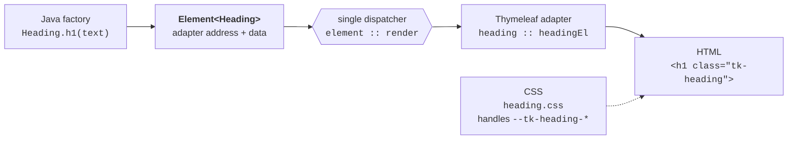
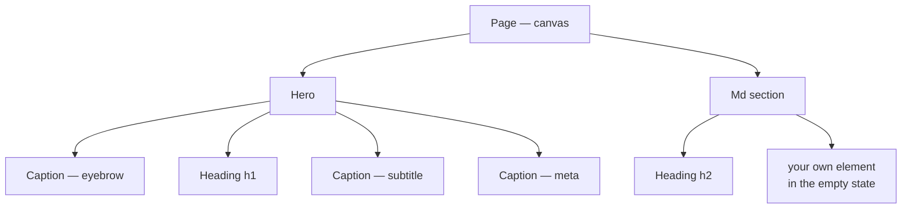
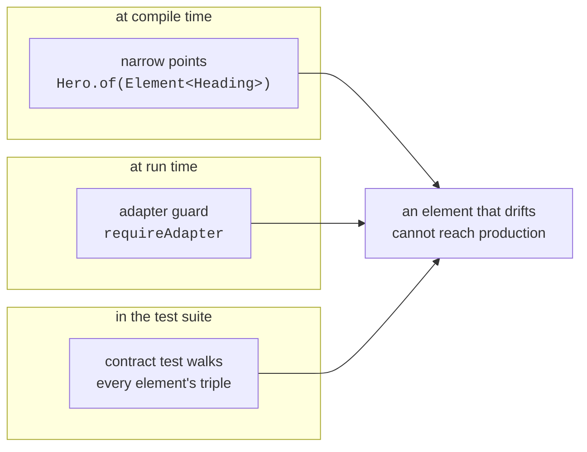

# thymekit

[](https://github.com/thymekit/thymekit/actions/workflows/build.yml)
[](https://thymekit.github.io/thymekit/tests/)
[](https://thymekit.github.io/thymekit/coverage/)
[](https://thymekit.github.io/thymekit/mutation/)
[](LICENSE)
[](#getting-started)
[](#getting-started)

**Everything is an element, and an element is made of elements.**

Server-side Java has no notion of a UI component. A "component" ends up scattered — some model code in
a controller, a fragment in a template file, a few rules in a global stylesheet — and nothing holds the
three together. Rename a CSS class and the fragment keeps the old one. Add a model key and the template
silently renders nothing. The compiler helps with none of it, so consistency becomes a matter of
vigilance across the whole project.

thymekit makes the element a first-class object, the way Java makes everything an object. Every element
is a triple — a Java factory, a Thymeleaf fragment and a CSS file — behind one entry point and one
address. The factory returns `Element<K>`, the only currency of composition. Elements go into elements
without limit: a caption into a heading group, a heading into a section, a section onto a page.
Containers render through a single dispatcher and know no list of bricks, which is why the set never
stops being extensible — from reusable elements you build reusable elements.

```java
@GetMapping("/ingredients/{slug}")
String ingredient(@PathVariable String slug, Model model) {
    Ingredient it = api.bySlug(slug);
    return PageModel.of(model)
        .title(it.name())
        .add(Hero.of(Heading.h1(it.name()).build())
            .eyebrow(Caption.eyebrow("Catalogue").build())
            .subtitle(Caption.subtitle(it.latinName()).build())
            .build())
        .add(Md.of(it.description())
            .title(Heading.h2("Description").build())
            .emptyHint("No description yet")
            .build())
        .render("ingredient-page");
}
```

Pages become declarations in Java. You touch templates and CSS when you build a new element — and then
hardly ever again.

Every number above is produced by the build and published to
[thymekit.github.io/thymekit](https://thymekit.github.io/thymekit/) — tests, coverage, the mutation
report and the API docs, with nothing in between.

## Getting started

```groovy
implementation 'io.thymekit:thymekit'
```

Java 21 or newer, Spring Boot 4, Thymeleaf 3.1.

**1. Nothing to configure.** Auto-configuration registers the markdown renderer, its `#md` expression
object and the tidy-render dialect. Each bean is `@ConditionalOnMissingBean` — declare your own and
yours wins; tidy rendering switches off with `thymekit.tidy.enabled=false`.

**2. One stylesheet**, before your own, so your theme can override it:

```html
<link rel="stylesheet" th:href="@{/thymekit/ui.css}">
```

**3. A document of your own** — the page shell belongs to you, and all it has to do is render the flow:

```html
<head>
  <title th:text="${pageTitle}">Page</title>
</head>
<body>
  <div class="page" th:classappend="${pageClass}">
    <th:block th:replace="~{fragments/thymekit/element :: renderAll(${elements})}"/>
  </div>
  <th:block th:replace="~{fragments/thymekit/element :: scripts(${assets})}"/>
</body>
```

The canvas fills four model keys and expects nothing else: `pageTitle`, `pageClass`, `elements` and
`assets`. The only class it puts there by itself is `page-canvas`; anything your theme hooks onto —
an audience, a section of the site — you add with `pageClass("...")`.

Name it as you like and pass the name to `render(view)`; `render()` without arguments looks for a
template called `page`. The kit ships no page document for your pages, so it never dictates a layout —
the only document it carries is the showcase's own.

**4. Your theme** maps the handles in your own stylesheet — the library is never edited to change how
things look:

```css
:root {
    --tk-heading-font: 'Cormorant Garamond', serif;
    --tk-caption-meta-color: #8a8a8a;
}
```

## See it live

The kit ships with its own showcase. Mount it with one controller method and every element is there,
live — rendered by your engine, served by your static handling, wearing your theme:

```java
@GetMapping("/thymekit-demo")
String demo(Model model) {
    return Demo.page(model);
}
```

## Anatomy of an element



Java, template and CSS are no longer three places to keep in sync by hand: they are one element with
one address, and a contract test walks every element to prove the triple still holds.

## Elements of elements



Every node above is an `Element` — and so is the page itself. Composition is closed: put elements
together and you get an element again, which is what makes the set an engine rather than a catalogue
of widgets.

## What keeps it consistent



## Writing your own element

An element of your own is written exactly the way the kit's own are — same triple, same guards:

```java
public final class Price {

    public static Element<Price> of(String amount, String currency) {
        return Element.Descriptor.<Price>of("fragments/my/price", "priceEl")
            .with("amount", amount)
            .with("currency", currency)
            .build();
    }
}
```

The fragment reads the descriptor as `${e['amount']}`, the CSS file carries the element's handles, and
the element goes anywhere any other element goes — onto a canvas, into a slot, inside a bigger element
of your own.

## The elements

| Element | Factory | Adapter | CSS |
|---|---|---|---|
| Heading | `Heading.h1(text)…h6(text)` — `id`, `href`, `srOnly` | `heading :: headingEl` | `heading.css` |
| Caption | `Caption.eyebrow/subtitle/label/meta(text)` | `caption :: captionEl` | `caption.css` |
| Hero | `Hero.of(Element<Heading>)` — eyebrow, subtitle, meta lines | `hero :: heroEl` | `hero.css` |
| Md | `Md.of(markdown)` — title, empty state, empty-state action | `md-section :: mdSectionEl` | `md-section.css` |
| Canvas | `PageModel.of(model)` — title, own page classes, flow of elements, `render(view)` | — | — |

Headings, captions and hero form the outline of a page, and the canvas guards it: at most one H1 per
page, and a caption never joins the outline at all.

## Contributing

Patches are welcome. Sign your commits off (`git commit -s`) to certify the origin of the code — a
[DCO](https://developercertificate.org/), not a contributor agreement: nobody signs their rights away,
and the project cannot be relicensed behind your back.

## Licence

[Mozilla Public License 2.0](LICENSE) — file-level copyleft with an explicit patent grant. Use the kit
in anything, including closed commercial software; write your own elements next to it and keep them to
yourself. What must stay open is this library's own files: change one of them, publish that change.

## What it is not

It is not a replacement for Thymeleaf — it is a discipline on top of it. Server-rendered HTML, no
client framework. Theming happens through `--tk-*` handles in your own stylesheet; the library is
never edited to change how things look.
