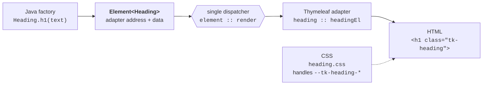
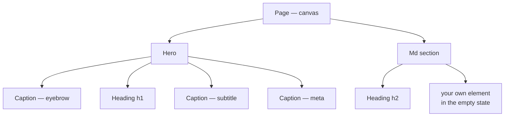
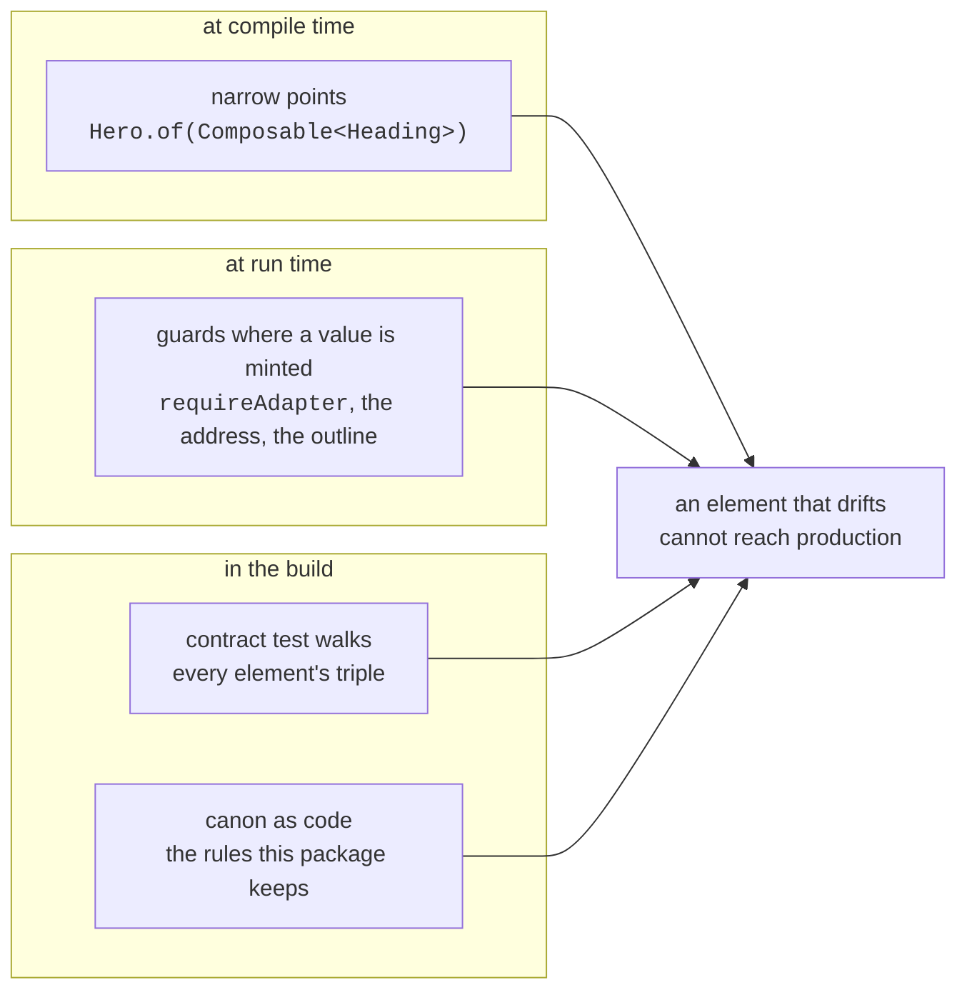
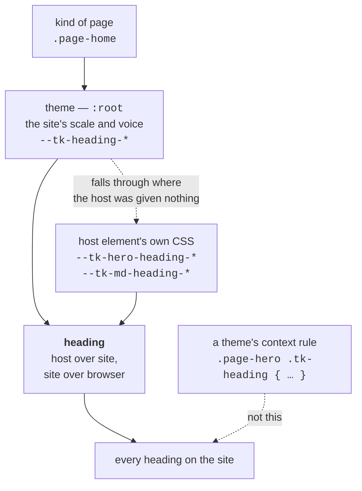

# thymekit

[](https://github.com/thymekit/thymekit/actions/workflows/build.yml)
[](https://thymekit.github.io/thymekit/main/tests/)
[](https://thymekit.github.io/thymekit/main/coverage/)
[](https://thymekit.github.io/thymekit/main/mutation/)
[](LICENSE)
[](#getting-started)
[](#getting-started)

**Everything is an element, and an element is made of elements.**

Server-side Java has no notion of a UI component. A "component" ends up scattered — some model code in
a controller, a fragment in a template file, a few rules in a global stylesheet — and nothing holds the
three together. Rename a CSS class and the fragment keeps the old one. Add a model key and the template
silently renders nothing. The compiler helps with none of it, so consistency becomes a matter of
vigilance across the whole project.

thymekit makes the element a first-class object, the way Java makes everything an object. Every element
is a triple — a Java factory, a Thymeleaf fragment and a CSS file — behind one entry point and one
address. The factory returns `Element<K>`, the only currency of composition; a place that takes one
takes anything that becomes one, so between an element and the next there is nothing to write. Elements go into elements
without limit: a caption into a heading group, a heading into a section, a section onto a page.
Containers render through a single dispatcher and know no list of bricks, which is why the set never
stops being extensible — from reusable elements you build reusable elements.

```java
@GetMapping("/ingredients/{slug}")
String ingredient(@PathVariable String slug, Model model) {
    Ingredient it = api.bySlug(slug);
    return PageModel.of(model)
        .title(it.name())
        .add(Hero.of(Heading.h1(it.name()))
            .eyebrow(Caption.eyebrow("Catalogue"))
            .subtitle(Caption.subtitle(it.latinName())))
        .add(Section.of(Heading.h2("Description"))
            .add(Md.of(it.description()).emptyHint("No description yet")))
        .render("ingredient-page");
}
```

Pages become declarations in Java. You touch templates and CSS when you build a new element — and then
hardly ever again.

Every number above is produced by the build and published to
[thymekit.github.io/thymekit/main](https://thymekit.github.io/thymekit/main/) — together with
[the showcase itself](https://thymekit.github.io/thymekit/main/showcase/), rendered at build time, so
you can see what the kit produces before adding a line of it to your project.

Every commit publishes a site of its own — `/<sha>/`, with its own tests, coverage, mutation report
and showcase, [listed here](https://thymekit.github.io/thymekit/). A change is easier to judge as a
page with numbers beside it than as a diff, and it can be judged before it is merged.

## Getting started

```groovy
repositories {
    mavenCentral()
    maven {
        url = 'https://maven.pkg.github.com/thymekit/thymekit'
        credentials {
            username = providers.gradleProperty('gpr.user').orElse(providers.environmentVariable('GITHUB_ACTOR'))
            password = providers.gradleProperty('gpr.key').orElse(providers.environmentVariable('GITHUB_TOKEN'))
        }
    }
}

dependencies {
    implementation 'io.thymekit:thymekit:0.1.0'
}
```

Java 21 or newer, Spring Boot 4, Thymeleaf 3.1.

The kit is published to GitHub Packages, which asks every consumer for a GitHub username and a token
with `read:packages` — that is their rule for public packages, not ours. Maven Central, where nothing
of the sort is needed, follows once the `io.thymekit` namespace is verified. Until then the jars are
also attached to every [release](https://github.com/thymekit/thymekit/releases).

**1. Nothing to configure.** Auto-configuration registers three beans: the markdown renderer, the
markdown dialect that puts `#md` into your templates, and the tidy-render dialect. Nothing at all is
registered where there is no template engine to register it for, so a project that took the kit for its
java and renders no pages carries no Thymeleaf. Each bean is `@ConditionalOnMissingBean` — declare your own and
yours wins; tidy rendering switches off with `thymekit.tidy.enabled=false`.

Tidy rendering is worth a sentence of its own, since it changes what your pages look like on the wire.
Adapters are written to be read — indented, one condition per line — and Thymeleaf, having removed its
own tags, leaves that indentation behind as text: on a page of a hundred elements, thousands of blank
lines. The dialect turns formatting whitespace between tags into a single newline indented by nesting
depth, and does nothing else: `pre`, `textarea`, `script` and `style` are untouched, a space between two
inline elements is untouched because there it means something, and a node that carries words keeps its
own indentation, because a space beside a word may be the space between two words. HTML only — in a text
or javascript template whitespace is content, not formatting. A post-processor of your own sees the
template as written or the page as served depending on which side of `TidyDialect.PRECEDENCE` it
declares itself.

**2. One stylesheet**, before your own, so your theme can override it:

```html
<link rel="stylesheet" th:href="@{/thymekit/ui.css}">
```

**3. A document of your own** — the page shell belongs to you, and all it has to do is render the flow:

```html
<head>
  <th:block th:replace="~{thymekit/element :: render(${head})}"/>
</head>
<body>
  <th:block th:replace="~{thymekit/element :: render(${page})}"/>
  <th:block th:replace="~{thymekit/element :: scripts(${assets})}"/>
</body>
```

Both lines render an element. The page is one — it carries an adapter address, holds its flow as data
and goes through the same dispatcher as a heading does — and so is the head, so what the page says
about itself is said once, in Java, and printed in one place. The `<main>` landmark comes with the
page: it is not something a kit should trust every document to remember.

```java
PageModel.of(model)
    .title(it.name())                                   // the tab, and the title of a link preview
    .description(it.summary())                          // the sentence under a search result
    .canonical("https://shop/ingredients/" + it.slug())  // when more than one address leads here
    .image(it.photoUrl())                               // the picture a messenger shows
    .robots(NOINDEX)                                    // a draft, a filtered listing, a page for one visitor
```

`Robots` carries the four directives that change what a visitor sees in a search result — `NOINDEX`,
`NOFOLLOW`, `NOARCHIVE`, `MAX_IMAGE_PREVIEW_LARGE` — and one of them arrives without being asked: a
page that was given a picture and is not kept out of the index also says `max-image-preview:large`,
because the consumer has already declared a picture worth showing and a search engine's own default is
a thumbnail. That is the only opinion the head holds, and it is inferred from something already said.

Absent parts print nothing: a page without a description is honest, a page with an empty description
tag is not. The kit never guesses the canonical address — only the consumer knows where a page lives —
but it does insist that the two addresses which leave the page are absolute. A relative `og:image` is
not a smaller picture, it is no preview at all, and a canonical link travels as `og:url` to a scraper
that has no document to resolve it against. So `image("/img/baobab.jpg")` is refused where it is
written, rather than silently producing a page whose preview never appears.

The canvas fills four model keys and expects nothing else: `page` and `head`, the two elements above;
`assets`, the scripts of the tree; and `pageTitle` — the bare string, for a document that wants to show
the title somewhere of its own. The tag itself is printed by the head element alone, so the two cannot
disagree. The only class it puts there by itself is `page-canvas`; anything your theme
hooks onto — an audience, a section of the site — you add with `pageClass("...")`, and the column it
draws is tuned by `--tk-page-width` and `--tk-page-padding`.

Name it as you like and pass the name to `render(view)`; `render()` without arguments looks for a
template called `page`. The kit ships no page document for your pages, so it never dictates a layout —
the only document it carries is the showcase's own.

**4. Your theme** maps the handles in your own stylesheet — the library is never edited to change how
things look:

```css
:root {
    --tk-heading-font: 'Cormorant Garamond', serif;
    --tk-caption-meta-color: #8a8a8a;
}
```

## See it live

The kit ships with its own showcase. Mount it with one controller method and the elements are there,
live — rendered by your engine, served by your static handling, wearing your theme, with a frame in the
stock scope beside them showing what they look like when a theme says nothing at all:

```java
@GetMapping("/thymekit-demo")
String demo(Model model) {
    return Demo.page(model);
}
```

## Anatomy of an element



Java, template and CSS are no longer three places to keep in sync by hand: they share one suffix path —
`io/thymekit/Heading.java`, `templates/thymekit/heading.html`, `static/thymekit/heading.css` — they are
one element with one address, and a contract test walks every element to prove the triple still holds — every adapter
the kit declares, since the test reads the fragments rather than a list somebody maintains, and every
class an element prints has to have a rule in its stylesheet.

## Elements of elements



Every node above is an `Element` — and so is the page itself. Composition is closed: put elements
together and you get an element again, which is what makes the set an engine rather than a catalogue
of widgets.

## What keeps it consistent



The last one is worth naming, because it is the part a reader cannot see in the code. Twenty-one rules
state what this package is:

- a class that hands out elements is final and cannot be instantiated;
- whatever has a `build()` returning an element says so by implementing `Composable`;
- nothing but `Element` hands a descriptor out;
- a `Composable` is settled where it is taken and never held in a field;
- nor inside a collection, which is holding it too;
- nothing public is mutable;
- nothing hidden is written for a caller that does not exist;
- what more than one element uses is public, since two users make a policy and not a detail;
- nothing keeps state beside the call that made it;
- a cached answer is filed under the whole question: the arguments by position, and the object asked;
- no element names another element's template;
- the core does not know its own demo exists;
- the model is written by the canvas alone;
- every element and every vocabulary is listed in the table below;
- the number of rules in this list is the number of rules there are;
- every public class of the kit has a spec of its own;
- what is not meant to be extended is final and says so;
- one call spelled twice says the same thing about what may be absent;
- a name the kit puts in somebody else's registry carries the kit's own;
- no class names another element's adapter, unless it owns it or is asking for one;
- and no line of the sources ends in a space.

None of them names a class: a rule that lists what it applies to is a list to forget, which is the
failure this canon exists to remove. Each is a test, and each was made to fail before it was kept — a
rule that cannot fail states nothing.

The same thinking decides what the kit checks about a page and what it simply makes impossible.
**A requirement an element can make unrepresentable is not a check.** A caption takes a `LocalDate`
rather than a string, so "yesterday" never reaches a `datetime` attribute; `newTab()` brings `noopener`
with it, so a link cannot lose it; a heading has no default level, so nothing lands in the outline by
accident. When the picture element arrives, its alternative text will be an argument to the factory and
not an option — and no page will ever need to be scanned for pictures without one. What is left for a
check is what no single element can see: the outline of the whole page, and its anchors. Those two the
canvas asks before it renders, and a page that fails either does not ship.

## Theming

An element ships structure and nothing else. Its look comes from handles — CSS custom properties named
after the element, `--tk-heading-*`, `--tk-caption-*` — and a theme is a file that hands them values.
There are no shared design tokens in the kit: an element is tuned through its own handles only, listed
at the top of its CSS file, so a theme keeps its own vocabulary to itself.

```css
:root {
    --tk-heading-font: 'Cormorant Garamond', serif;
    --tk-heading-size-1: 36px;
    --tk-heading-size-2: 26px;
    --tk-heading-tracking: 1px;
    --tk-caption-eyebrow-transform: uppercase;
}
```

That much is ordinary. What matters is the rule the kit exists to enforce: **a look is declared once,
for the element, and reused — not restated per place.** The application this kit grew out of had
seventy CSS rules describing eleven distinct heading looks; the other fifty-nine were the same looks
re-derived in another context, with the letter-spacing drifting between 0.4px and 3px along the way.
Nobody decided that. It is what happens when there is no object to hold the decision.

So the kit asks a theme to keep four rules:

**One scale, set once.** Six heading levels get six values in `:root`. A level *is* the look: there is
no separate design for "the H1 inside the hero", because a page has one H1 — the canvas enforces that —
and the hero is merely where it lives.

**One axis of deviation: the kind of page.** A landing page may legitimately want a louder H1 than an
inner page. The canvas already marks the page with a class of your choosing, so the theme writes
`.page-home { --tk-heading-size-1: 64px }`. One axis, named, declared where the canvas puts its marker.

**The host dresses what it hosts.** A page has more than one kind of heading — the title, the section
titles, the chapters an author writes inside a text. They differ not by level and not by place on the
screen, but by the element they live in, and in this kit every place a heading can appear is an element
itself. So an element that hosts headings may dress them, in its own CSS, under its own name:

```css
/* hero.css — the hero dressing the title of the page */
.page-hero-group > .tk-heading {
    --tk-heading-host-font: var(--tk-hero-heading-font, var(--tk-heading-font, inherit));
}
```

Two rules keep this from becoming the disease it cures. The host may only pass on a value **its own
handle was given** — it never invents a literal, so a theme that said nothing about heroes still gets
its site scale in the hero, untouched. And the order of precedence is declared once, by the heading
element itself: host over site, site over browser.

**A theme writes no selectors over the kit's classes.** No `.page-hero .tk-heading { … }`. Wanting to
is the signal that something is missing — an element, or a handle on one — and that is what to fix.
This is the rule that catches the disease at the door, because every context-specific rule looks
harmless on the day it is written.

There is one place where the answer is the opposite, and it is worth knowing why. Inside
`.rich-content` the markup belongs to whoever wrote the text — tables, quotes, code, whatever markdown
allows and whatever it allows next — and no set of handles can cover a space that has no edges. So the
kit keeps only what stops a page from breaking there (an image that would overflow its column, a code
block that would push the layout sideways) and a theme styles the rest directly. Rule four protects
the kit's own elements from rules about places; content was never one of them.

What the kit's own stylesheets may hold follows from the same line. Containment, always: it is what
keeps a page whole. Anatomy — which part of an element sits above which, and how far apart — also,
since it is what the element is. The space *around* an element, no: whoever places it decides that,
which is why the page gap is a handle on the canvas rather than a margin on a hero. And a look, no
either: it is a handle, or it is the browser's. Where the kit removes something the browser gives — a
link's underline — it gives a handle to put it back.



Two notes about delivery, since a theme is also a file a browser has to fetch. `ui.css` imports one
file per element — a shape that is easy to read and six requests to fetch; if that matters on your
pages, bundle it in your build, it is plain CSS with no processing behind it. And if your theme wants
a webfont, link it in the document rather than `@import` it from inside a stylesheet, where it costs a
round trip before the first line can be drawn. The kit's own showcase asks for no webfont at all: it is
mounted inside somebody else's application, and sending their visitors to a third-party host is not a
decision a library gets to make for them.

Every element file also resets its own handles inside `.tk-defaults`, so a frame carrying that class is
a place a theme cannot reach — useful for a style guide that wants to show the stock beside the dressed
version, which is exactly what the showcase does with it.

The showcase is the worked example, and it shows all three at once:
[`demo.css`](src/main/resources/static/thymekit/demo.css) gives the site a voice — section titles as
small tracked gold labels — then lets the hero dress the page title in a serif display face and the
markdown section dress an author's chapters in a quieter scale of its own.
[Look at it](https://thymekit.github.io/thymekit/main/showcase/): three faces on one page, and not a
single rule in that file names a place. Its whole vocabulary is blocks of handle values plus two rules
for the showcase's own document, `body` and the page column.

## Writing your own element

An element of your own is written exactly the way the kit's own are — same triple, same guards:

```java
public final class Price {

    public static Element<Price> of(String amount, String currency) {
        return Element.Descriptor.<Price>of("fragments/my/price", "priceEl")
            .with("amount", amount)
            .with("currency", currency)
            .build();
    }
}
```

Check it the way the kit checks its own, in a test of yours:

```java
@Test
void myElementsKeepTheContract() {
    ElementContract.of(Price.of("12.00", "EUR"), Badge.of("in stock"))
        .renderedBy(templateEngine)
        .styledBy("static/my/ui.css")
        .check();
}
```

It looks at what no compiler can: that the address points at a fragment that exists and declares itself
— the element's own and every script it depends on — that the adapter is named the way an adapter is
named, that a script has not been put where an element belongs, **that the keys the adapter says it
reads are the keys the factory puts in**, that the element renders something a browser would show, and
that every class it prints has a rule in the stylesheets you name. If your
templates do not live under `templates/`, say `templatesUnder("views/")` and it looks there. It reports
everything wrong at once, and the kit's own suite takes the same walk over the kit's own elements.

An adapter says which keys it reads, in a comment above the fragment that Thymeleaf strips before
anything is rendered:

```html
<!--/* keys: amount, currency */-->
<span th:fragment="priceEl(e)" class="my-price">…</span>
```

That closes the last place where Java and markup were held together by attention alone. A key an
element carries that its adapter never reads is data travelling for nothing, and fails the walk. The
other direction — a key an adapter reads that nothing puts in, a branch of the template nothing can
reach — is a claim about your samples rather than about the element, so it is asked for with
`coveringEveryKey()`; the kit makes that claim about its own.

The fragment reads the descriptor as `${e['amount']}`, the CSS file carries the element's handles, and
the element goes anywhere any other element goes — onto a canvas, into a slot, inside a bigger element
of your own. Nothing has to be implemented for that: an element is recognised by what it is, not by
what it declares. If your element has a builder rather than a single factory method, have the builder
implement `Composable<Price>` — one method it already has — and callers stop writing `.build()` in
front of it, exactly as they do for the kit's own.

## The elements

| Element | Factory | Adapter | CSS |
|---|---|---|---|
| Heading | `Heading.h1(text)…h6(text)` — `id`, `href` with `rel`/`newTab`, `lang`, `srOnly` | `heading :: headingEl` | `heading.css` |
| Caption | `Caption.eyebrow/subtitle/label/meta(text)` — `time`, `lang`; `Caption.inRole(...)` is the guard a host of yours uses to ask for one | `caption :: captionEl` | `caption.css` |
| Hero | `Hero.of(Element<Heading>)` — eyebrow, subtitle, meta lines, a `statusBadgeEl` badge and an `actionsEl` row of your own | `hero :: heroEl` | `hero.css` |
| Md | `Md.of(markdown)` — title, empty state, empty-state action, `linkRel` | `md-section :: mdEl` | `md.css` |
| Canvas | `PageModel.of(model)` — own page classes, flow of elements, `render(view)`; renders as the `page` element | `canvas :: canvasEl` | `canvas.css` |
| — | `Element<K>` — the currency itself: an address, data, and value semantics. `Element.Descriptor.of(...)` mints one, `Element.raw/script(...)` wrap a fragment of yours, and the guards a host needs — `settle`, `requireAdapter`, `requireRenderable`, `requireTag` — are public beside them | — | — |
| — | `Outline` — the headings of a page and whether they add up: one H1, no level skipped, none html does not have. The canvas checks it before rendering | — | — |
| — | `Anchors` — the addresses inside a page: no two things answering to one name. Checked by the canvas beside the outline | — | — |
| — | `Composable<K>` — whatever becomes an element; `ElementContract` — the walk over a triple, for your elements as much as ours | — | — |
| — | `Rel` — what a link says about itself, with the policy that goes with it: `Rel.of(...)` guards and orders, `Rel.forNewTab(...)` cannot lose `noopener`, `Rel.tokens(...)` writes the attribute | — | — |
| Head | filled by the canvas — title, description, canonical, image, `robots`; renders as the `head` element | `head :: headEl` | — (it prints tags, not looks) |

Text written by visitors says so: `Md.of(review).linkRel(UGC, NOFOLLOW)` marks the links that leave
the site, and only those — an address starting with `/` or `#` is your own, and holding back its weight
would be a wound self-inflicted. The kit has no default here, because a review and an editor's article
need opposite ones and only the consumer knows which is on the page.

Text carries what machines need beside what people read. `Caption.meta("12 March 2026").time(LocalDate.of(2026, 3, 12))`
prints `<time datetime="2026-03-12">12 March 2026</time>` — the wording, the language and the format
stay yours, the attribute is what a search engine and a screen reader understand, and it takes a
`LocalDate` or an `Instant` rather than a string, so "yesterday" cannot get in. `lang("la")` on a
heading or a caption marks the Latin name inside a Russian catalogue as Latin. A heading that is a link
says what it is with `rel(NOFOLLOW, UGC)`, and `newTab()` brings `noopener` along whichever order they
are written in — without it the opened page can reach back through `window.opener`, and remembering
that at every link by hand is the kind of vigilance the kit exists to remove — and it is removed from
your linking elements too, since `Rel` publishes what the kit's own elements use: `Rel.of(values)` for
the option, `Rel.forNewTab(values)` at build time, `Rel.tokens(values)` for the attribute. An `href` that executes
instead of navigating (`javascript:`, `data:`, `vbscript:`, and the spellings a browser unpicks, like
`java\tscript:`) is refused where it is written, and `rel` or `newTab` on
a heading that is not a link is refused too, rather than printed nowhere.

A section is an element of its own: a heading and a slot for whatever belongs under it — a markdown
block, a row of cards, several of them. It takes a name from the heading you gave an address: write
`Section.of(Heading.h2("Composition").id("composition"))` and the section carries `aria-labelledby`, so it becomes a region a screen reader can jump to
and a place a link can point at. Say nothing and it stays an ordinary box — landmarks are worth having
few of, and the decision that a section stands on its own is the consumer's, not the kit's. The kit
never invents the id itself: an address is a promise to whoever saved the link, and a slug made from a
heading breaks the day someone edits the text.

Headings, captions and hero form the outline of a page, and the canvas guards it before rendering: at
most one H1 per page, no heading level skipped — a page that uses h4 while nothing on it is an h3 has a
hole a screen reader falls straight through — no level outside h1..h6, since the adapter renders
nothing at all for a seventh, and a caption never joins the outline at all.

Headings an author wrote inside markdown are placed under the page rather than beside it: the topmost
level found in the text is lowered to a ceiling — h2 by default — and the rest move by the same amount,
never past h6. A `#` in the description of an ingredient is therefore an h2 in the page, not a second
H1. The relative shape of the text is what survives; that is what a level means in markdown, where the
same document may be shown inside a page, inside a card or inside a letter — so the move is whatever
fits under the deepest heading the author wrote, and a text already using all six levels stays as it
is rather than losing a depth. The ceiling belongs to the
renderer (`new MarkdownRenderer(3)`, and `1` renders the text exactly as authored, for pages written
entirely in markdown); replace the bean and the whole site follows.

What the kit does not do is close a hole the author left. Write `#` and then `###` and the gap travels
with the text into the page, and the canvas guard never sees it — content is data, it arrives as HTML
long after the guard has run. Where an editor lets authors write headings, that is where the levels
they may use are worth constraining.

## Where the line runs

A framework inverts control: it owns the flow, you fill the places it left for you, and it knows the
shape of your application — that a page has a layout, a component a lifecycle, a form a binding. Its
extension points are a list decided in advance, and the day your case is not on the list you either
fight it or fork it. A kit is called by you. It knows one rule — an element is an address and data,
and composition is closed — and nothing about your domain.

The line the kit keeps is this:

> **It may know about HTML and about elements. It may not know about your domain, your layout or your
> looks.**

That is why a guard about HTML being correct belongs here — one H1 to a page, no level skipped, an
`og:image` that a scraper can resolve, a new tab that cannot lose `noopener` — and a guard about how
your site works never does. There is no notion of a page kind, no layout to inherit from, no theme
object, no component lifecycle. What the kit adds to Spring and Thymeleaf is one object; the flow
stays yours.

It buys four things and costs one. Adding an element is the same twenty lines as every element already
here, so the set never closes. A broken element breaks one element, where a framework's default breaks
every page or is worked around on every page. The page — its document, its layout, its addresses —
stays with you. And you can leave element by element, because what comes out is plain HTML with named
handles rather than something only this library understands. What it costs is that nothing is decided
for you: a page is a declaration you write, not a template you fill.

One part of the kit does invert control, and it is worth naming: the canvas. It decides that a page
has a `<main>`, refuses an outline with a hole in it, and prints the head from what it was told once.
That is the kit knowing about HTML, which the line allows — and it is exactly as far as it goes.

## Contributing

Patches are welcome. Sign your commits off (`git commit -s`) to certify the origin of the code — a
[DCO](https://developercertificate.org/), not a contributor agreement: nobody signs their rights away,
and the project cannot be relicensed behind your back.

## Licence

[Mozilla Public License 2.0](LICENSE) — file-level copyleft with an explicit patent grant. Use the kit
in anything, including closed commercial software; write your own elements next to it and keep them to
yourself. What must stay open is this library's own files: change one of them, publish that change.

## What it is not

It is not a replacement for Thymeleaf — it is a discipline on top of it. Server-rendered HTML, no
client framework. Theming happens through `--tk-*` handles in your own stylesheet — with one
exception, the markup inside `.rich-content`, which belongs to whoever wrote the text and is styled
directly. The library is never edited to change how things look.
